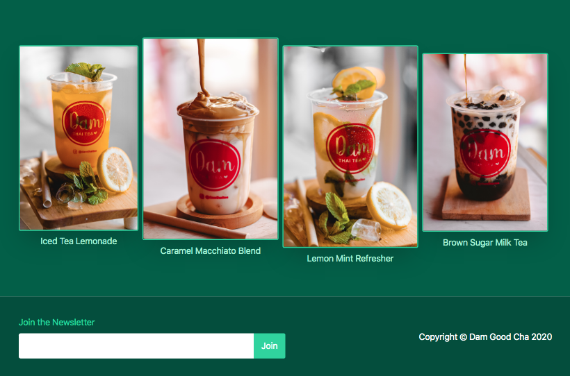
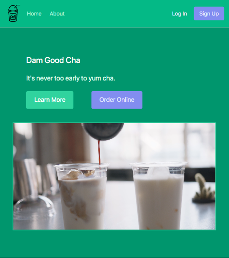

# Tailwind Tea Landing Page   

### Checkout the Live Version of the [Project](https://dcc5235.github.io/Tea_Landing/)!

A Tailwind CSS focused project which utilizes only Tailwind to style a static landing page.



---

## Installations
- Link Tailwind [CDN](https://cdnjs.com/libraries/tailwindcss) to HTML.
- You can also install Tailwind as a [npm package](https://tailwindcss.com/).
- VS Code autocompletion classes are available - install Tailwind CSS IntelliSense, or view classes on the Tailwind [documentation](https://tailwindcss.com/docs).

---

## Notes
- No custom CSS required; classes can be written inline.
- To apply to a CSS styleshhet, simply use ```@apply```. See documentation [here](https://github.com/tailwindlabs/tailwindcss/pull/2159).

---

## Apply Directly into Classes

- Flexbox: ```class="flex justify-between items-center"```

- Hover: ```class="hover:text-green-100"```

- Transitions: ```class="transition ease-in duration-150```

- Media Queries: ```class="md:flex"```



---

## Credits
- Icons from [Icon Finder](https://www.iconfinder.com/)

---

## Contributors

Dany Chheang dany.chheang@gmail.com
